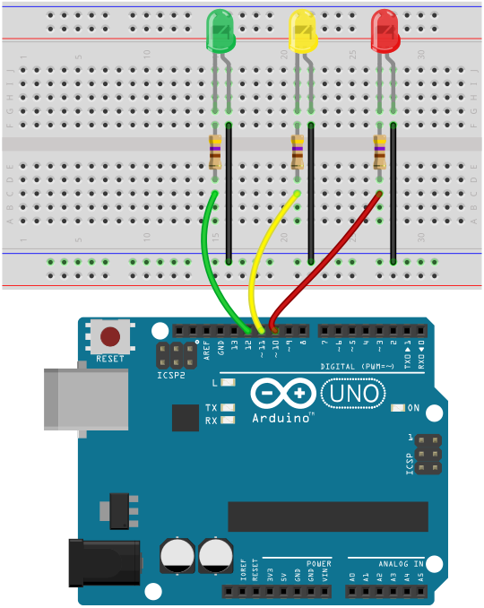

# Arduino Traffic Light

This is a simple Arduino project that simulates a traffic light using LEDs. It can be used as a learning tool or as a basis for more complex traffic light systems.

## Table of Contents

- [Getting Started](#getting-started)
- [Components](#components)
- [Circuit Diagram](#circuit-diagram)
- [Usage](#usage)
- [Contributing](#contributing)
- [License](#license)

## Getting Started

To get started with this project, follow these steps:

1. Clone the repository: `git clone https://github.com/Binura-Thiranjaya/Arduino-Traffic-Light.git`
2. Connect the Arduino board to your computer.
3. Open the Arduino IDE.
4. Open the `traffic_light.ino` file.
5. Upload the code to the Arduino board.
6. Connect the LEDs to the appropriate pins on the Arduino board.
7. Power up the Arduino board.

## Components

The following components are required for this project:

- Arduino board (e.g., Arduino Uno)
- LEDs (red, yellow, green)
- Resistors
- Breadboard
- Jumper wires

## Circuit Diagram

Here's a circuit diagram showing how to connect the LEDs to the Arduino board:

## Usage

Once the code is uploaded and the circuit is set up, the traffic light will start functioning. The LEDs will simulate the behavior of a traffic light, with the appropriate delays between each state.

## Contributing

Contributions to this project are welcome. If you find any issues or have any suggestions for improvements, please open an issue or submit a pull request.

## License

This project is licensed under the [MIT License](LICENSE).